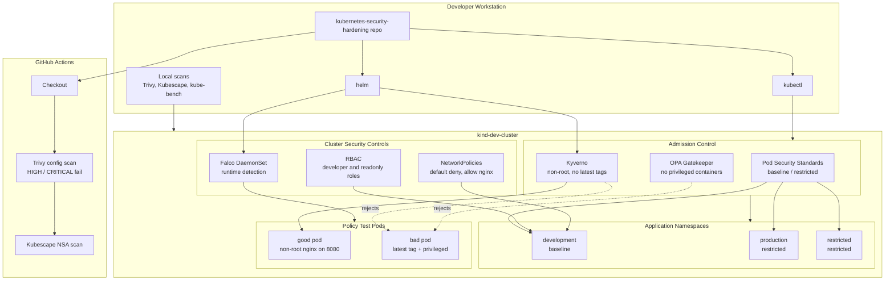
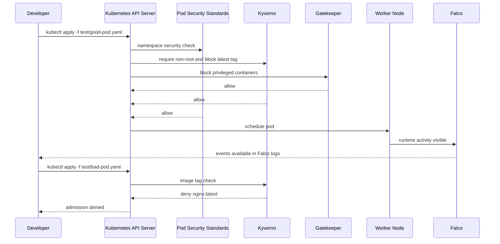

# Lab Architecture

This lab models a compact DevSecOps path for Kubernetes: secure manifests enter the cluster through admission control, runtime activity is monitored by Falco, and scanners validate both repository configuration and live cluster state.

## High-Level View



## Request Flow



## Components

| Area | Component | Purpose | Repo Path |
| --- | --- | --- | --- |
| Namespace security | Pod Security Standards | Enforce baseline or restricted behavior at namespace level | `namespaces/`, `pod-security/` |
| Access control | RBAC | Limit what users can do in `development` | `rbac/` |
| Traffic control | NetworkPolicy | Default-deny traffic and selectively allow nginx ingress | `network-policies/` |
| Admission control | Kyverno | Require non-root pods and block `latest` image tags | `policies/kyverno/` |
| Admission control | Gatekeeper | Block privileged containers | `policies/opa-gatekeeper/` |
| Runtime detection | Falco | Detect suspicious container activity on nodes | `runtime/` |
| Scanning | Trivy | Scan `kind-dev-cluster` for high and critical findings | `scanning/trivy.sh` |
| Scanning | Kubescape | Run NSA framework checks | `scanning/kubescape.sh` |
| Scanning | kube-bench | Run Kubernetes CIS-style checks | `scanning/kube-bench.sh` |
| CI/CD | GitHub Actions | Scan config on push | `.github/workflows/security-scan.yml` |
| Validation | Good and bad pods | Prove policy allow and deny behavior | `test/` |

## Security Layers

1. **Pre-merge checks:** GitHub Actions scans manifests with Trivy and Kubescape.
2. **Namespace guardrails:** Pod Security labels enforce baseline or restricted profiles.
3. **Admission policies:** Kyverno and Gatekeeper reject unsafe pod specs before scheduling.
4. **Least privilege:** RBAC limits user actions in the `development` namespace.
5. **Traffic isolation:** NetworkPolicies apply default-deny behavior.
6. **Runtime visibility:** Falco watches running workloads for suspicious activity.
7. **Cluster assessment:** Trivy, Kubescape, and kube-bench provide manual validation.

## Expected Test Behavior

`test/good-pod.yaml` should be admitted and run:

```bash
kubectl apply -f test/good-pod.yaml
kubectl get pod good
```

Expected status:

```text
good   1/1   Running
```

`test/bad-pod.yaml` should be denied because it uses `nginx:latest` and `privileged: true`:

```bash
kubectl apply -f test/bad-pod.yaml
```

Expected result:

```text
admission denied
```

## Current Known Gaps

These files are placeholders and should be completed before presenting the lab as fully production-like:

- `pod-security/baseline-namespace.yaml`
- `network-policies/allow-monitoring.yaml`
- `policies/kyverno/require-resources.yaml`
- `runtime/audit-policy.yaml`
- `runtime/falco-values.yaml`
